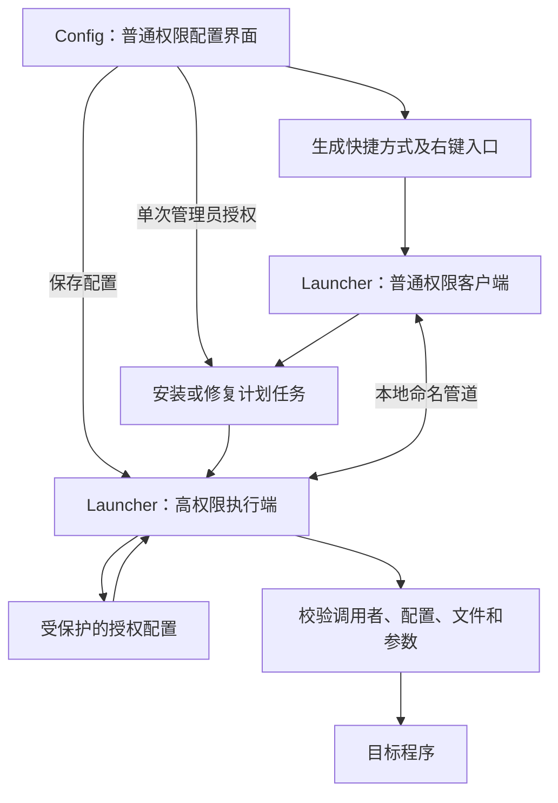

# UACToolBox 重构设计方案

版本：设计稿 1.0，2026-09-18。本文描述拟实现方案，不代表功能已经完成。

## 1. 目标与已确定的需求

- 配置程序使用 C#、WPF，普通权限启动，日常保存通过预授权后台任务完成。
- 日常启动使用独立的轻量程序，不加载 WPF、不显示控制台窗口。
- 使用预先授权的最高权限计划任务，避免日常启动重复请求 UAC。
- 支持导入、拖入已有快捷方式，自动回填参数等信息。
- 支持文件右键入口和生成带环境变量数据块的快捷方式。
- IPC 不借助临时文件传参，正确处理连续与并发启动。
- 移动安装位置后可以修复定位，尽量保留已生成的快捷方式。

第一版支持 Windows 10/11 x64，面向同一交互会话中的管理员账户个人使用。跨账户授权、标准用户输入另一管理员凭据、多会话并行、ARM64 暂不作为首发承诺。检测到配置进程身份与预定使用者不一致时，应解释限制，不自动把授权写给另一个账户。

## 2. 技术与交付形态

| 部分 | 方案 | 说明 |
| --- | --- | --- |
| 配置界面 | C#、.NET 10 LTS、WPF、WPF UI | Fluent 风格；先验证组件库与所选框架的兼容性 |
| 启动程序 | 独立 C# WinExe | 不引用 WPF；普通入口为 asInvoker |
| 系统集成 | Windows API、COM | 计划任务、Shell Link、注册表 |
| IPC | 带访问控制的本地命名管道 | 默认选型；无临时传参文件 |
| 配置持久化 | 有版本号的 JSON | 授权配置置于受保护目录；界面偏好分开保存 |
| 发布 | 自包含发布优先 | 不承诺只有两个物理文件；依赖可以放在同一安装目录 |

逻辑入口为 `Config.exe` 和 `Launcher.exe`。后者有客户端和执行端两个角色。先保证可用及启动测量，再评估启动端 Native AOT；AOT 依赖所选 COM 互操作实现兼容性，不作为首版前提。

配置端和启动端 manifest 均使用 asInvoker。首次安装及系统设置操作通过独立 runas 辅助进程请求管理员授权。执行端的高权限来自计划任务，不通过重复调用 runas 获得。

## 3. 模块与运行流程



### 配置端

负责条目增删改、快捷方式解析、安装修复、右键注册、环境变量维护、日志查看。修改授权条目时显示最终路径、参数及工作目录。保存操作通过已授权执行端提交，无需再次 UAC。执行端核验同用户同会话及本安装 Config.exe 路径，校验配置并按修订号原子写入。

### 普通启动客户端

解析命令，尝试连接执行端；不存在时触发已安装计划任务，在限定时间内重试连接。提交请求并等待启动结果后退出。客户端不通过命令参数直接指定任意高权限执行路径。

### 高权限执行端

读取受保护配置、验证通信对端身份、检查请求并启动目标。每次执行使用独立的不可变请求快照。空闲 10 秒且无活动请求时退出；目标程序不计入执行端的活动请求，不等待其结束。空闲时间为初始值，后续依据测量调整。

### 计划任务

- 绑定明确的使用者 SID，以该使用者最高可用权限运行，只在其登录的交互会话使用。
- 执行动作为受保护位置中的 Launcher.exe，固定参数为 `broker`。
- 按需运行，不添加开机或登录触发器。
- 任务访问权限只允许预定使用者触发，管理员修改；安装后验证权限配置。
- 禁止重复执行端实例；客户端同时触发任务时，仍连接同一个执行端。
- 配置界面的“启动测试”需要测试普通权限客户端链路，不能仅从管理员界面启动成功就认定免提示链路通过。

## 4. 启动协议及错误反馈

示意命令接口：

```text
Launcher.exe launch <entry-id>
Launcher.exe resolve <selected-file>
Launcher.exe broker
Config.exe import <selected-file>
```

`launch` 只接受授权项 ID。`resolve` 用于右键，匹配已有授权配置，不赋予所选任意文件执行权限。`broker` 即使被手动调用，也必须检查身份和权限；命令名称本身不代表授权。

管道采用长度前缀加 UTF-8 JSON，消息上限初始设为 64 KiB。请求包含协议版本、随机请求 ID、授权项 ID及操作类型；响应包含请求 ID、结果码、可选进程 ID 和适合用户阅读的说明。

- 管道拒绝远程客户端；ACL 限定预定 SID。
- 服务端检查客户端令牌 SID、会话及适用的完整性级别，不接受低完整性或匿名请求。
- 客户端验证服务端身份及受保护的执行文件，避免连接伪造端点；具体令牌与进程句柄检查需在 Windows 原型阶段验证。
- 执行端缓存本生命周期内已处理请求 ID，避免同一连接重试导致重复启动。
- 请求总时限初始设为 10 秒，连接与启动错误分别记录。队列设置上限，达到上限返回忙碌状态。
- 执行端发送响应后等待客户端收讫确认再断开，避免丢弃未读响应。客户端收到有效结果后，即使确认发送失败也保留该结果。连接后单独给予 30 秒响应等待时间。
- 发送后失联且无法判断是否执行时，返回“结果未知”，不自动再次启动。跨执行端重启不承诺 exactly-once。
- 成功静默退出；用户交互入口失败时显示简短原生提示，自动调用可选择静默并读取退出码。

建议结果类别：成功、输入无效、尚未安装、无授权项、权限不符、目标不存在、配置已变化、请求繁忙、启动失败、超时或结果未知。成功表示创建启动请求成功，不代表目标应用业务执行成功。

共享内存仍可作为后续可选实现，但不能复用旧版单槽结构及 SuspendThread 协议。若使用，必须实现有界队列、完整消息边界、序号、正常锁释放、崩溃恢复和逐请求确认。现阶段命名管道更适合该请求量。

## 5. 配置模型与权限边界

授权配置放在 ProgramData 下独立的受保护目录，按使用者 SID 隔离。管理员和 SYSTEM 可写，指定使用者按需只读；程序二进制所在目录也必须防止普通权限修改。界面偏好放在用户配置目录，不与执行授权混用。

| 字段 | 说明 |
| --- | --- |
| schemaVersion、revision | 格式版本与配置修订号 |
| id、displayName | 稳定 ID、快捷方式名称（兼容旧存储字段） |
| shortcutDirectory | 自定义快捷方式目录，空值表示当前用户桌面 |
| ownerSid | 授权归属账户 |
| executablePath | 经解析和验证的可执行文件绝对路径 |
| argumentsRaw | 原始命令行参数文本，保留引号和空格 |
| workingDirectory | 明确的工作目录 |
| showMode | 正常、最小化、最大化；目标程序可能覆盖此请求 |
| iconPath、iconIndex | 快捷方式及界面图标来源 |
| enabled | 是否允许启动 |
| sourceShortcut | 可选的导入来源，仅作为元数据 |

导入快捷方式优先保存原始参数文本。不同程序的命令行解析规则可能不同，不能假设统一拆分再拼接就一定无损。以后若新增结构化参数编辑，需要明确转换规则和适用范围。

按后续需求调整：目标程序及工作目录不再检查所有者或可写权限；用户授权固定路径后，该路径下的更新文件无需重新授权。工具自身及授权配置仍保留权限保护。第一版高权限目标限定本机 EXE；脚本、网络路径和复杂重解析路径暂不自动授权。文件检查存在竞争窗口，最终启动路径和文件身份一致性属于原型验证重点，不能仅检查一次路径字符串。

客户端不能提交替代路径、任意附加参数或新工作目录。配置原子替换，执行端按修订号重新加载，删除或禁用条目在下一次请求时生效。配置文件更新可使用受保护目录内的暂存文件；“无临时文件传参”并不禁止安全的配置持久化。

## 6. 快捷方式导入、生成和迁移

### 导入回填

文件选择器、拖放和右键导入共用一个解析服务。输入 EXE 时回填文件名和图标；输入 LNK 时通过 IShellLinkW / IPersistFile 读取目标、参数、起始位置、窗口状态、图标位置和索引。

- 对失效目标显示具体错误，保留已读取信息供用户修正。
- 递归快捷方式限制深度并检测循环。
- 不静默解析会产生网络访问或交互提示的目标。特殊安装器快捷方式不保证支持，应给出明确提示。
- 导入本工具生成的链接时优先识别授权 ID，打开现有条目，避免嵌套调用启动器。
- 导入后允许编辑；默认生成新链接，覆盖现有文件需要明确确认。
- 管理员窗口接收来自普通权限文件管理器的拖放可能受 UIPI 限制。浏览和右键导入作为可靠入口；拖放需专项验证，不能假设 WPF AllowDrop 即可跨权限工作。

### 环境变量快捷方式

使用稳定的机器环境变量指向 Launcher.exe。创建时通过 IShellLinkDataList 写入 EXP_SZ_LINK 数据块及相应标志，并保存可用的当前绝对目标；不能只调用 SetPath 填入带百分号的字符串。

链接参数只包含 `launch <entry-id>`。图标、显示名称沿用导入配置。工作目录和目标窗口状态以授权项为准，执行端显式应用，避免依赖启动器继承。

环境变量不是信任凭据：用户环境可以覆盖机器变量。最终权限边界仍由计划任务固定路径、受保护二进制及执行端校验决定。需要实测用户覆盖变量及旧进程环境缓存下的行为。

### 迁移修复

1. 在新位置运行管理员配置端，检查目录权限。
2. 验证组件完整性和版本，保留原授权 ID。
3. 更新计划任务绝对路径、环境变量、右键入口。
4. 广播环境变更，检测旧文件管理器进程是否仍缓存旧值；必要时提示重新登录。
5. 检查旧链接启动以及图标定位，报告需要重新生成的链接。

迁移不等于免安装便携：换机器仍需建立计划任务和授权配置。环境变量主要减少同机迁移时逐个修改快捷方式的成本。

## 7. 右键入口

| 菜单 | 动作 | UAC 行为 |
| --- | --- | --- |
| 添加到启动配置… | 启动 Config 并传入所选 EXE/LNK，自动回填 | 请求管理员权限 |
| 通过启动器运行 | 解析所选文件并匹配已授权项 | 正常安装后不重复请求 |

EXE 多个授权项匹配时不得随意选取，应提示通过已生成快捷方式启动。LNK 按解析后的目标、参数、工作目录匹配，窗口状态等配置冲突也需明确处理；同名不代表同一授权项。未授权时不执行，提供打开配置的选项。

第一版使用传统静态 Shell 菜单，Windows 11 可能出现在“显示更多选项”内。原生新菜单扩展不是首发范围。菜单命令中的启动器路径和所选文件路径均须正确引用。

## 8. 界面方案

采用 WPF UI 的 Fluent 控件，浅色和深色跟随系统，可手动切换。初始窗口约 1040×720 DIP，最小尺寸约 800×560 DIP；使用弹性布局和滚动区域，不按像素固定所有位置。

```text
┌─────────────────────────────────────────────────────────────┐
│ 启动管理                                      管理员模式    │
├───────────┬─────────────────────────────────────────────────┤
│ 程序      │ 程序                            ＋ 添加程序     │
│ 设置      │ [搜索名称或路径___________________________]     │
│ 诊断      │                                                 │
│           │ 图标  程序名称          已授权   ⋯              │
│           │       目标路径                   创建快捷方式   │
│           │                                                 │
│           │ 图标  另一个程序        目标失效 ⋯              │
│           │       目标路径                                  │
│           │                                                 │
│           │ 安装状态：正常                                  │
└───────────┴─────────────────────────────────────────────────┘
```

添加和编辑使用独立页面，与程序列表分开。管理进程按用户和会话保持单实例，重复打开时激活已有窗口；导入请求转交已有窗口，若编辑页已有填写或预填数据，则询问是否覆盖，默认保留。连续请求排队处理，避免叠加确认框。

创建/编辑页：

```text
添加程序                                       [选择文件]
快捷方式名称     [原名称_UACTB，可修改________________]
目标程序         [实际 EXE 路径_______________________]
启动参数         [原始参数文本________________________]
工作目录         [自动回填或明确选定__________________]
创建位置         [桌面 / 自定义文件夹…]
窗口状态         [正常 ▼]
图标             [预览] [更换]

授权说明：该配置允许通过启动器以管理员权限运行此目标。

[取消]                    [保存] [保存并创建快捷方式]
```

程序页操作包括编辑、启用/禁用、删除、创建快捷方式。删除提示现有快捷方式将失效，不自动删除无法确认归属的文件。空列表显示添加入口和支持的导入类型。

设置页包含安装状态、修复、迁移检查、右键菜单开关、主题、卸载。诊断页显示最近请求结果、安装检测项及日志导出，不默认记录完整命令行参数，避免把密码或令牌写入日志。

不以“白名单”混称两种权限行为。RunAsInvoker 兼容性功能作为后续独立高级选项，并明确提示不会获得管理员权限。首版聚焦已授权高权限启动。

## 9. 安装、更新和卸载

安装前验证路径、身份、现有任务和变量的归属。按步骤记录成功结果，失败时回滚本次新增内容，不能直接覆盖未知来源的同名任务或变量。

更新时停止接收新请求、等待已提交启动动作完成、退出执行端，再替换组件；不结束已启动的用户目标程序。版本不兼容时客户端给出修复提示。

卸载删除本工具创建的计划任务和右键入口；环境变量仅在值仍与本安装一致时删除。授权配置和已生成链接是否清理由用户选择，界面说明保留链接将无法启动。

## 10. 开发组织及阶段

建议分为 Config、Launcher、Contracts、WindowsIntegration 四个项目。Contracts 只定义协议、配置和错误码，不能依赖 WPF；WindowsIntegration 封装 COM、注册表和句柄生命周期。权限判断必须在执行端完成，不能只做在 UI 中。

| 阶段 | 交付 | 验收重点 |
| --- | --- | --- |
| 1：系统原型 | 计划任务、客户端和执行端最小闭环 | 同账户普通权限触发；无重复 UAC；身份与 ACL 验证 |
| 2：安全协议 | 受保护配置、命名管道、错误反馈 | 拒绝非法目标及参数覆盖；并发及断连行为 |
| 3：配置界面 | 程序列表、编辑、快捷方式导入 | 自动回填准确；管理员拖放限制有明确处理 |
| 4：系统入口 | 环境变量 LNK、右键、迁移修复 | 空格路径、旧环境缓存、移动后的启动 |
| 5：发布验证 | 安装回滚、卸载、日志、性能测量 | 干净系统可复现；无残留常驻窗口或进程 |

## 11. 验证清单与尚待实测事项

- 参数：空字符串、空格、中文、引号、尾部反斜杠，目标程序实收参数与原快捷方式一致。
- 快捷方式：图标索引、工作目录、窗口状态、失效链接、嵌套循环。
- 并发：至少 20 个并行请求，以请求 ID 核对一次请求一次结果；不同用户点击属于不同请求。
- 异常：计划任务缺失、执行端崩溃、目标移动、配置损坏、管道伪造、超时结果未知。
- 权限：低完整性进程、其他账户、可写目标目录、用户环境变量覆盖、未经配置的文件。
- 安装：目录迁移、更新中断、安装失败回滚、菜单重复注册、卸载后残留。
- UI：键盘导航、高 DPI、长路径显示、深浅主题和屏幕阅读器标签。

需要优先实测的技术风险包括 COM 发布兼容性、最高权限任务的实际运行身份、命名管道服务端身份校验、管理员 WPF 拖放、环境变量 LNK 的缓存行为和无窗口启动器对窗口状态的传递。

## 12. 面向用户的快速开始草案

1. 以普通权限打开配置程序。
2. 点击安装，完成一次管理员授权；环境变量和可选右键菜单设置分别请求管理员权限。
3. 选择程序或已有快捷方式，检查自动回填的目标、参数和工作目录。
4. 保存授权配置，创建新的启动快捷方式。
5. 日常通过快捷方式或已授权文件的右键入口启动。
6. 移动程序位置后，重新打开配置程序执行修复。

日常免重复提示建立在正确安装和明确授权的基础上；未授权条目、失效配置或执行错误应提供清晰反馈，而不是静默失败。

## 13. 免提示保存的协议补充

普通启动继续使用版本 1。配置保存使用版本 2 的 save-configuration 操作、非空请求 ID 和空条目 ID。执行端完成身份及配置进程路径校验后发出准许响应，客户端确认收到，再发送不超过 2 MB 的配置。保存结果沿用响应收讫确认。未知操作不执行，断连不自动重放。

持久化仍使用受保护的配置路径，不开放普通账户直接写权限；执行端保留配置归属、修订号和大小检查。首次安装后，当前用户可以不经再次管理员确认更改高权限启动配置；不将受保护进程路径检查视为抵抗同用户注入或自动化的完整安全边界。
